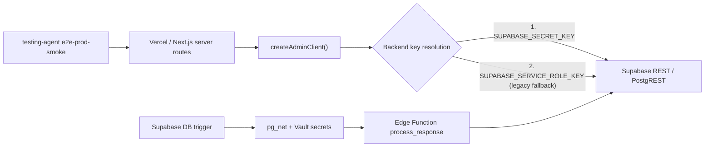

# Operación del Pipeline

## 0. Arquitectura operativa actual



Estado validado en producción el **29 de marzo de 2026**:

- `GET /api/jobs/admin-runtime-health` responde `200`
- `runtime.keySource = SUPABASE_SECRET_KEY`
- `runtime.keyFamily = sb_secret`
- `queryOk = true`
- `cd testing-agent && npx tsx src/index.ts e2e-prod-smoke --env-file ../.env.production.local` pasa `4/4`

## 1. Variables y secretos

App / Vercel:

- `SUPABASE_SECRET_KEY`
- `INGEST_API_SECRET`
- `CRON_SECRET`
- `PIPELINE_ALERT_WEBHOOK_URL`
- `PIPELINE_ALERT_EMAIL_TO`
- `SUPABASE_SERVICE_ROLE_KEY` (fallback legacy)
- `NEXT_PUBLIC_SUPABASE_URL`
- `NEXT_PUBLIC_SUPABASE_ANON_KEY`

Edge function `process_response`:

- `SUPABASE_URL`
- `PROCESS_RESPONSE_SERVICE_ROLE_KEY`
- `PROCESS_RESPONSE_HOOK_SECRET`

## 2. Desplegar la edge function

```bash
supabase functions deploy process_response --no-verify-jwt
supabase secrets set PROCESS_RESPONSE_HOOK_SECRET=change-me
```

La función espera:

- `POST`
- header `x-hook-secret: <PROCESS_RESPONSE_HOOK_SECRET>`

## 3. Configurar secretos en Postgres Vault

El trigger `trg_dispatch_process_response` lee secretos desde Vault con `get_pipeline_secret(...)`.
También requiere la extensión `pg_net` habilitada para poder invocar la edge function desde Postgres.

Ejemplo:

```sql
select vault.create_secret(
  'https://<project-ref>.supabase.co/functions/v1/process_response',
  'process_response_function_url',
  'Edge function URL for pipeline dispatch'
);

select vault.create_secret(
  'change-me',
  'process_response_hook_secret',
  'Shared secret for process_response dispatch'
);
```

El trigger solo necesita `process_response_function_url` y `process_response_hook_secret`.
La edge function se protege con `x-hook-secret` y usa `PROCESS_RESPONSE_SERVICE_ROLE_KEY` para refrescar `campaign_stats`.

Para entornos locales con Postgres en contenedor, usa una URL alcanzable desde el contenedor, normalmente algo como:

```text
http://host.docker.internal:54321/functions/v1/process_response
```

## 4. Cron del batch

`vercel.json` agenda:

- `GET /api/jobs/analyze-batch`
- `GET /api/jobs/admin-runtime-health`

El endpoint acepta:

- `x-cron-secret: <CRON_SECRET>`
- `Authorization: Bearer <CRON_SECRET>`
- opcional `?hours=24`
- opcional `?source=cron|manual|response_hook`

Health check de runtime:

- `GET /api/jobs/admin-runtime-health`
- devuelve `runtime.keySource`, `runtime.keyFamily`, `runtime.hasKey` y `queryOk`
- no expone el valor del secreto

Backfill controlado:

- `GET /api/jobs/backfill-analysis`
- `POST /api/jobs/backfill-analysis`

`GET` lista candidatos de backfill. `POST` ejecuta recálculo histórico por `campaignIds` o por selección automática.
Parámetros útiles:

- `limit`
- `force`
- `organizationId`
- `batchSize` para escalonar el backfill total por lotes

## 5. Observabilidad

Tablas nuevas:

- `pipeline_dispatch_events`: cola/resultado de invocaciones del trigger hacia `process_response`
- `batch_job_runs`: auditoría de ejecuciones del análisis batch
- `pipeline_notifications`: intentos reales de alertas operativas por webhook/email/log
- `analysis_run_snapshots`: snapshot comparable por corrida analítica
- `campaign_ona_runs`: estado operativo del análisis de red
- `backfill_run_metrics`: ejecución agregada, drift, calidad y telemetría del backfill histórico

Consultas útiles:

```sql
select status, count(*)
from pipeline_dispatch_events
group by 1
order by 1;
```

```sql
select created_at, hook_name, status, reason, response_status
from pipeline_dispatch_events
order by created_at desc
limit 20;
```

```sql
select created_at, trigger_source, status, processed, succeeded, failed, error_message
from batch_job_runs
order by created_at desc
limit 20;
```

```sql
select created_at, severity, channel, status, alert_code, recipient
from pipeline_notifications
order by created_at desc
limit 20;
```

```sql
select created_at, analysis_run_id, logic_version
from analysis_run_snapshots
order by created_at desc
limit 20;
```

El job batch también ejecuta `refresh_pipeline_dispatch_events()` al arrancar para reconciliar respuestas HTTP pendientes.

## 6. Smoke test recomendado

1. Ejecutar `supabase db reset`
2. Sembrar demo con `npm run seed:results`
3. Servir la edge function localmente
4. Configurar secretos de Vault para la URL, hook secret y JWT
5. Levantar la app con `npm run dev`
6. Ejecutar `cd testing-agent && npx tsx src/index.ts e2e-http`

Se espera ver:

- respuestas `web` guardadas
- `ingest_events` en `completed`
- al menos un `batch_job_runs` en `completed`
- `pipeline_notifications` en `sent`, `failed` o `skipped`
- `campaign_results` y `campaign_analytics` materializados para la campaña de prueba
- `analysis_run_snapshots` guardados para la campaña
- `GET /api/jobs/backfill-analysis` devolviendo candidatos o vacío controlado

### Smoke productivo oficial

```bash
cd testing-agent && npx tsx src/index.ts e2e-prod-smoke --env-file ../.env.production.local
```

Checks esperados:

- reachability del sitio
- batch route con cliente admin válido
- `direct ingest` llegando a validación de payload
- chequeo opcional de DB si el env file incluye una credencial backend explícita

## 7. Rotación de credenciales backend

Secuencia recomendada:

1. Crear una nueva `sb_secret`
2. Sembrarla en Vercel como `SUPABASE_SECRET_KEY`
3. Mantener `SUPABASE_SERVICE_ROLE_KEY` solo como fallback temporal
4. Sembrar `PROCESS_RESPONSE_SERVICE_ROLE_KEY` para la edge function
5. Redeploy de Vercel y `process_response`
6. Validar con `GET /api/jobs/admin-runtime-health`
7. Validar con `e2e-prod-smoke`
8. Recién entonces desactivar la key legacy en Supabase Dashboard

`GET /api/jobs/admin-runtime-health` es la prueba mínima para aceptar una rotación. Si `queryOk = false`, no ejecutar backfills ni jobs históricos.

## 8. Notas operativas

- El runtime web del admin client resuelve credenciales en este orden:
  1. `SUPABASE_SECRET_KEY`
  2. `SUPABASE_SERVICE_ROLE_KEY`
- El trigger de `responses` solo despacha para fuentes no `web` y respondentes ya `completed`.
- El survey web sigue refrescando `campaign_stats` al completar la encuesta, para evitar recálculos parciales durante un llenado en progreso.
- Si faltan secretos de Vault, el trigger no rompe la escritura: registra `pipeline_dispatch_events.status = 'skipped'` con razón `missing_pipeline_secret`.
- Las alertas operativas activas salen por webhook o email solo si configuras `PIPELINE_ALERT_WEBHOOK_URL` y/o `PIPELINE_ALERT_EMAIL_TO`. Si no, quedan registradas como `log/skipped`.
- La heurística batch usa `incremental_stats_refresh` para campañas activas con lógica vigente y `full_recompute` para cierres, lógica desactualizada o backfills.

## 9. Operación de AI Governance

Tablas:

- `campaign_ai_insights`: contenido gobernado por campaña e `insight_type`
- `campaign_ai_generation_events`: historial operativo de intentos de generación

Campos de control en `campaign_ai_insights`:

- `status`
- `prompt_version`
- `schema_version`
- `input_fingerprint`
- `warnings`
- `validation_errors`
- `generated_at`
- `published_at`

Comprobaciones útiles:

```sql
select insight_type, status, prompt_version, schema_version, generated_at, published_at
from campaign_ai_insights
where campaign_id = '<campaign_uuid>'
order by insight_type;
```

```sql
select insight_type, status, provider, model, latency_ms, error_message, created_at
from campaign_ai_generation_events
where campaign_id = '<campaign_uuid>'
order by created_at desc
limit 20;
```

Regla de lectura:

- si existe `published`, las páginas consumen ese insight
- si no existe `published`, usan el latest `draft` o `approved`

La página `/campaigns/[id]/results/ai-governance` es la vista operativa para revisar cobertura, warnings, fallos y estado editorial.
